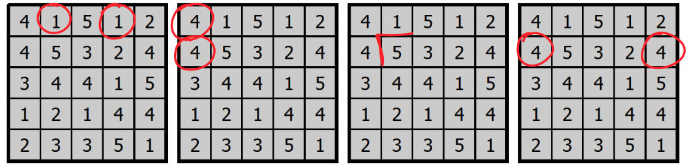
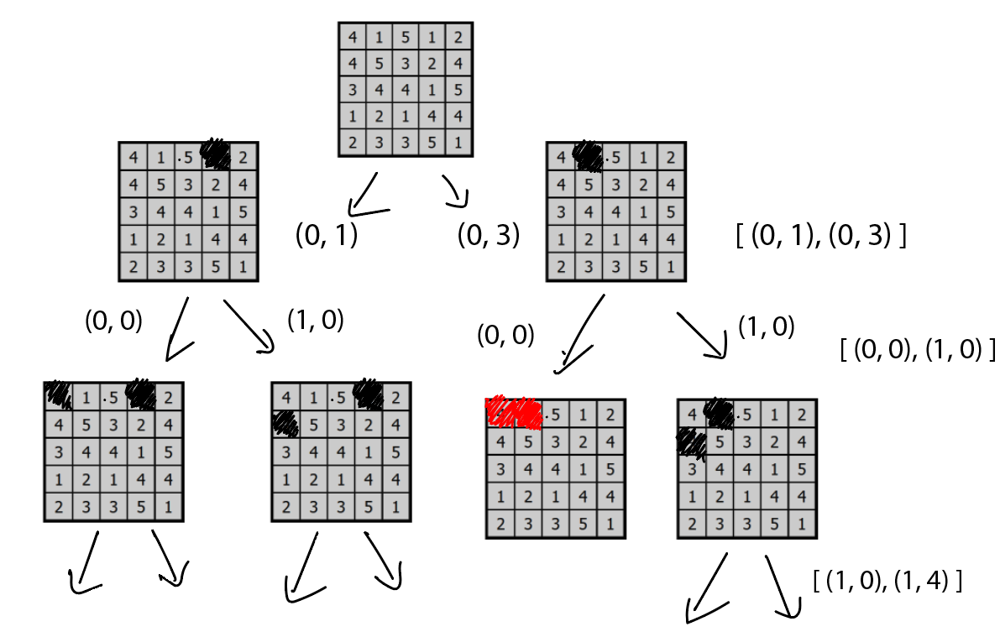
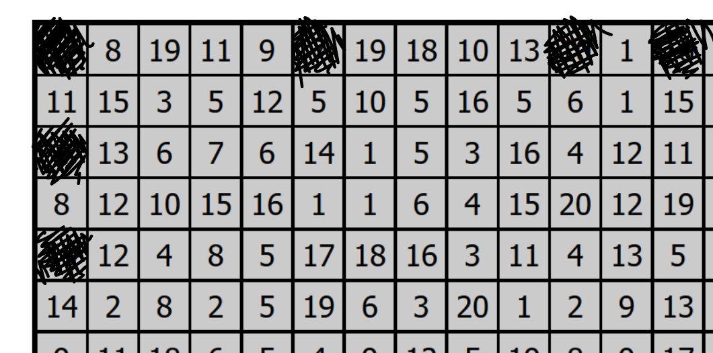
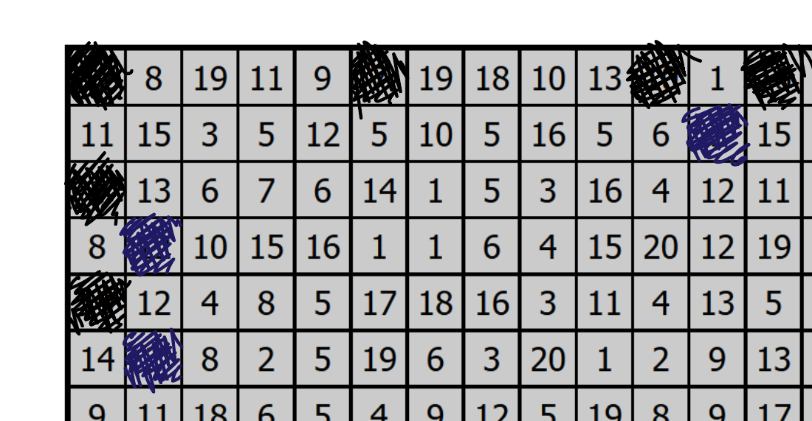

# HitoriSolver
Это программа, решающая головоломку Hitori

# О самой головоломке

Hitori - это логическая головоломка с простыми правилами и сложным решением.

Правила игры Hitori просты:
Необходимо закрасить некоторые ячейки таблицы, выполнив следующие условия:
- В любой строке/столбце ни одно число не должно повторяться
- 2 чёрных ячейки не могут быть расположены рядом по горизонтали или вертикали
- Все незакрашенные ячейки должны быть объединены в одну группу

# Об архитектуре программы

Для виртуального окружения используется библиотека poetry

Запуск из консоли: ```python -m hitori_solver.main```

В методе ```interactive_loop``` в файле ```main.py``` происходит бесконечный цикл принятия ввода от пользователя с помощью библиотеки click
В цикле можно ввести саму таблицу для последующего решения в любом формате, главное, чтобы там были нужные числа разделенные хоть чем-то
Так же можно установить ограничение на максимальную сумму чисел во всех строках и столбцах вводимых матриц

Шаги решения:
1) Полученная матрица преобразуется в экземпляр ```Field```, который хранит такую же матрицу
2) ```Field``` подается в класс ```Solver```, который пробегая все возможные покраски, выдает все минимальные решения в виде списка объектов типа ```Tiling```
3) ```Tiling``` олицетворяет решение головоломки - это по сути булева матрица такого же размера. Единицы в ней означают те клетки, которые должны быть закрашены
4) С помощью метода ```print_painted_over``` класса ```Field``` выводится решение в виде изначальной матрицы с закрашенными клетками, соответствующими полученным ```Tiling```

# Об алгоритме решения

Поскольку ключевая задача - закрасить все дубликаты на всех строках и столбцах, смысла рассматривать клетки, не повторяющиеся на столбце/строке нет
Поэтому первый шаг - найти наборы одинаковых чисел, что происходит с помощью метода ```_find_sets_to_resolve```

Но ищем мы их в особом порядке - уголком: сначала первая строка, затем первый столбец, вторая строка и так далее
После прохода i-ой строки и i-го столбца, но только если i > 0, если там нашли хоть какие-то наборы, добавляем в список элемент [(-1 i)], говорящий о первом. Позже вернемся к тому, зачем это нужно


Посмотрим на примере, как будет меняться список sets, который позже нам вернет ```_find_sets_to_resolve```


_Процесс заполнения \_find_sets_to_resolve_
1) [ [ (0, 1), (0, 3) ] ]
2) [ [ (0, 1), (0, 3) ], [ (0, 0), (1, 0) ] ]
3) [ [ (0, 1), (0, 3) ], [ (0, 0), (1, 0) ], [ (1, 0), (1, 4) ] ]
4) [ [ (0, 1), (0, 3) ], [ (0, 0), (1, 0) ], [ (1, 0), (1, 4) ], [ (-1, 1) ] ]
...

Теперь наша задача - это закрасить клетки таблицы так, чтобы в каждом таком наборе не более одной осталось не закрашенной, какую задачу и будет выполнять ```_resolve_sets```


_Процесс рекурсии \_resolve_sets_

В процессе решения мы пользуемся одни и тем же экземпляром ```Tiling``` для заполнения клеток. Чтобы не пришлось создавать полную копию (что затратно) в каждой итерации мы запоминаем, какие клетки зарисовали, чтобы при окончании итерации и вернуть и вернуться в предыдущий вызов функции вернуть ```Tiling``` в прежнее состояние

При вызове функции надо подавать ```set_num``` - индекс набора ```sets```, который нужно рассмотреть, по этому, при рекурсивном вызове подаем это число на единицу больше

Если при вызове оказалось, что это число равно самому размеру ```sets```, значит - все что нужно было закрасить закрашено и осталось проверить связность с помощью поиска в ширину. И в случае ее наличия, копируем ```Tiling``` в поле answer

Однако, остается лишь проблема оптимизации. Главная проблема в том, что связность мы проверяем только в самом конце. А допустим, что замкнутая клетка появилась в самом начале, тогда будут пройдены тысячи мертворожденных решений, в каждом из которых будет запущен BFS, что займет очень много времени

Но как сразу обнаруживать несвязность? Немного поэкспериментировав, можно заметить, что почти в ста процентов случаев, если решение оказалось не связным, то оно имеет клетку, замкнутую со всех сторон, а их обнаруживать очень даже легко - нужно просто проверить, есть ли вокруг нее открытые клетки.

А когда проверять клетки на замкнутость? А для этого мы и идем уголком. Посмотрим на примере, когда клетки могут замкнуться?


_Проход первого уголка_

Очевидно, что единственная клетка, которая может замкнуться, это (0, 0), но ради нее одной действовать не будем


_Проход второго уголка_

И легко понять, что клетки i-ых строки и столбца могут закрыться только после закрашиваний в (i + 1)-ых строке и столбце поэтому именно после прохода (i + 1)-ых строки и столбца мы проверяем наличие замкнутых клеток на предыдущих строке и столбце, ведь в другом месте они возникнуть не могли

Таким образом, мы сможем обнаруживать несвязность как можно раньше и сразу же отбрасывать ненужное решение
